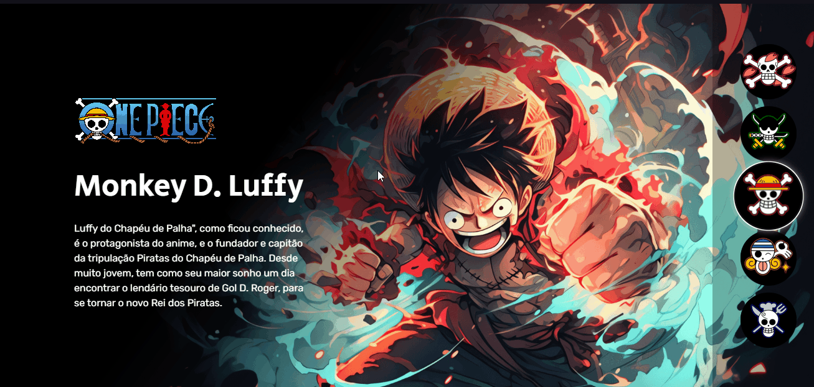

# Projeto One Piece
Primeiro projeto HTML / CSS / JS


### Preview do projeto😁


### [Entre no site](https://niivl.github.io/Projeto-One-Piece/)

## ⛏️Tecnologias ultilizadas
- HTML
- CSS
- JavaScript

## 🕵️Como ultilizar
- Escolha um personagem do anime One Piece ao lado e você terá informações desse personagem.

## 🖇️Clone o projeto
Observação: Tenha o Git instalado no seu computador. Caso não tenha, você pode baixar [aqui](https://git-scm.com/downloads).

#### 1 - URL do projeto
URL: https://github.com/NiivL/Projeto-One-Piece.git

2 - Abra o terminal e navegue até o diretório desejado:
```bash
cd /caminho/para/o/diretorio
```
3 - Clone o repositório:
```bash
git clone https://github.com/NiivL/Projeto-One-Piece.git
```

### Pronto, agora você pode contribuir com o projeto😊